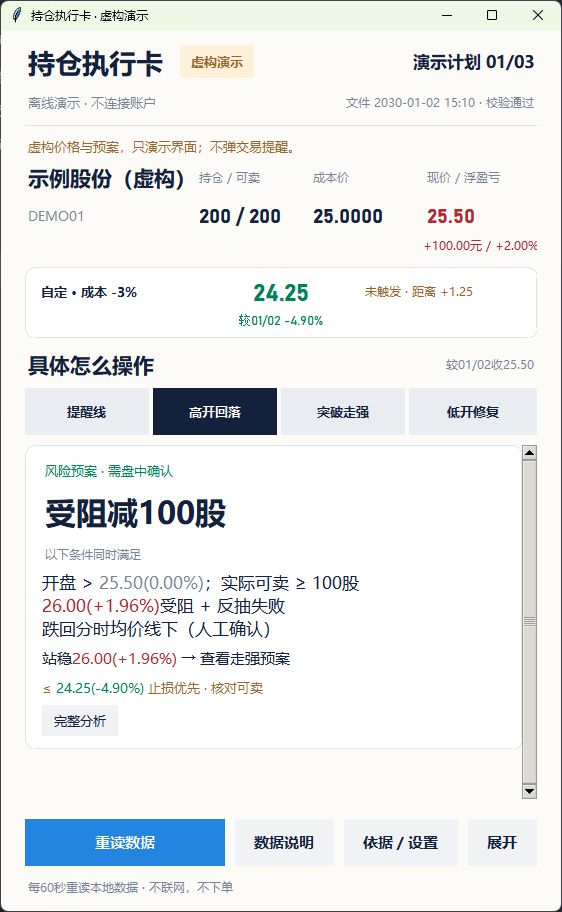

# 持仓执行卡 | Position Desk

一个本地运行的中文桌面工具：把持仓、自定价格提醒线和有日期的操作预案放在同一张卡片上。

**默认只用虚构演示数据，不联网、不连接券商、不下单。基于 MIT 许可证开源。**

项目仓库：[12liuyu/position-desk](https://github.com/12liuyu/position-desk)。当前版本为早期源码版，需要本机安装 Python，不是打包好的 EXE。



## 能做什么

- 展示持仓数量、可卖数量、成本、现价和估算浮盈亏。
- 以用户输入的成本和百分比计算提醒线；比例不是软件推荐值。
- 操作情景切换、简短条件、完整说明、小窗、置顶与可选声音。
- 价格与对应涨跌幅一起标色：涨红、跌绿、平与缺失为灰；明确收盘基准日期。
- 本地数据每60秒重读。结构、日期或金额不一致时暂停提醒，拒绝使用旧结果充当新结果。
- 有效本地数据确认移除持仓后结束相应提醒；关掉弹窗只算已读。

## 快速体验

运行环境：Python 3.11 或更高版本，带 Tkinter。当前实际验收平台为 Windows；其他平台尚未验收。
没有第三方 Python 运行依赖，不需要 API Key。可先运行 `python -m tkinter` 检查图形环境。

```powershell
python -B app.py --demo
```

Windows 也可双击 `start_demo.cmd`。首次体验只显示 `DEMO01 示例股份（虚构）`，固定演示日期为2030年1月2日；不会把日期改成今天，也不会弹交易提醒。

```powershell
python -B app.py --demo --check
python -B -m unittest discover -s tests -p "test_*.py" -v
```

图形测试需要可用桌面，不具备图形环境时不计为图形验收通过。

## 使用自己的本地数据

把按照 [数据格式](docs/data-format.md) 制作的 `account.json` 放到**项目目录之外**，显式指定该目录：

```powershell
python -B app.py --data-dir "D:\PrivatePositionData"
python -B app.py --data-dir "D:\PrivatePositionData" --check
```

该目录仅为示意，不会自动创建或搜索。`--demo` 与 `--data-dir` 不可同时使用。

“重读数据”只读取该文件，不等于从券商重新采集。上游需先写临时文件，再原子替换 `account.json`。本项目不包含券商适配器、截图采集器、市场数据服务凭证或外部任务调度。计划和行情须由用户自行维护或由另行授权的数据适配器提供。

界面的“校验通过”仅指输入结构、时间、名称一致性和金额对账，不是独立券商认证。真实身份、行情来源、交易日历、复权及除权基准需在上游核对。软件不会把相同的代码和名称当成已获官方验证。

## 明确边界

- 这是**提醒与预案呈现工具**，不是自动交易软件。没有买入、卖出、撤单接口。
- 没有自动AI分析、新闻分析、分时形态识别或动态止损。切换情景不代表条件已发生。
- 不承诺任何价格成交，不保证止损幅度或收益。浮盈亏及提醒线不含完整税费和滑点。
- 本版仅支持价格精度0.01的股票。ETF、期权、期货、融资融券等未支持。
- 演示不发交易弹窗。本地模式还需要有效输入、`session_open=true`、工作日时段以及新鲜行情才会重复提醒；程序自身不认证节假日。
- 没有开机自启或后台服务；退出后不再刷新。最小化时继续运行。

## 数据与隐私

输入文件只读。设置和提醒记录保存到用户本机 `PositionDeskPublic` 目录，并按输入文件路径隔离；不与其他软件共用设置。默认在 Windows 的 `%LOCALAPPDATA%` 下，其他平台在用户主目录下。也可用 `--state-dir` 指定位置。

本地提醒记录可能含证券名称，**不要上传数据目录或设置目录**。提交 Issue 时请使用虚构样本，不附真实截图、日志、持仓或访问令牌。`.gitignore` 不是秘密扫描器，也不能删除 Git 历史里的数据。

## 开发与发布

代码结构：`app.py` 为窗口；`engine.py` 为数据校验与提醒状态；`planner.py` 为数值计算和预案匹配；`sources.py` 为显式本地数据入口。

`tools/build_release.py` 使用明确文件清单构建 ZIP，不递归打包工作目录，不包含 `.git`、历史提交、账户数据、运行日志或备份。若名单中文件缺失、出现符号链接或典型敏感字段，构建失败。该工具的模式检查只是辅助，公开前仍需人工审查所有代码、图片和许可证。

```powershell
python -B tools/build_release.py
```

生成的 `dist/position-desk-source.zip` 是独立源码包，**构建脚本不会创建仓库或上传**。文件清单与校验值记录在 `dist/manifest.json`。

## 许可证

采用 [MIT License](LICENSE)，版权所有 2026 12liuyu。允许在保留版权和许可声明的条件下使用、修改、分发和商业使用，不要求公开修改后的源码。软件按原样提供，不作收益或适用性保证。

官方说明：[GitHub 仓库许可](https://docs.github.com/en/repositories/managing-your-repositorys-settings-and-features/customizing-your-repository/licensing-a-repository)。当前没有捆绑第三方库、商业字体文件或行情数据。
